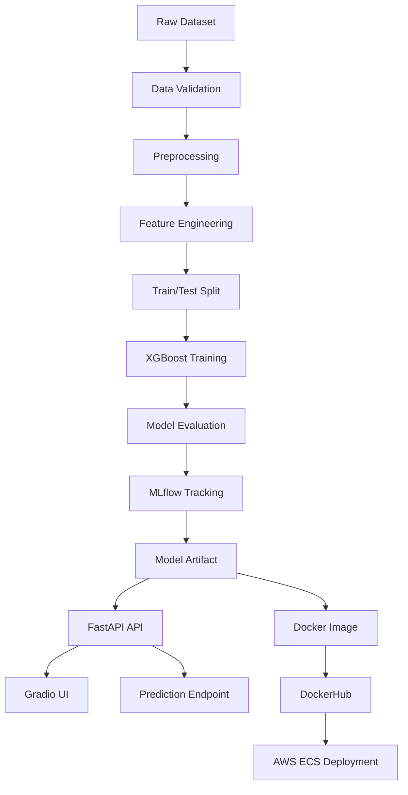

# Telco Customer Churn Prediction – End-to-End ML System

## Overview

This project implements a complete **machine learning system for predicting telecom customer churn**, covering the entire lifecycle from **data validation and model training to API serving and cloud deployment**.

The goal was not just to train a model but to **build a production-ready ML pipeline** that can be reproduced, tracked, and deployed reliably.

The system integrates **MLflow for experiment tracking, FastAPI for inference serving, Docker for containerization**.

---

## Problem

Customer churn directly impacts telecom revenue. Identifying customers likely to leave allows businesses to take proactive retention actions.

This project builds a machine learning pipeline capable of:

* predicting churn probability
* exposing predictions through an API
* providing a simple UI for manual testing
* enabling reproducible model experimentation

---

## Key Features

### End-to-End ML Pipeline

* Data validation using **Great Expectations**
* Preprocessing and feature engineering pipeline
* **XGBoost classifier** optimized for tabular data
* Experiment tracking with **MLflow**

### Experiment Tracking

MLflow records:

* model parameters
* evaluation metrics
* training artifacts
* experiment runs

This ensures **reproducibility and traceability** across experiments.

### Model Serving

The trained model is served through a **FastAPI inference service**.

Endpoints:

| Endpoint        | Description                          |
| --------------- | ------------------------------------ |
| `GET /`         | Health check                         |
| `POST /predict` | Predict customer churn               |
| `/ui`           | Interactive Gradio testing interface |

### Interactive UI

A **Gradio interface** allows quick testing of the model without writing API calls.

This makes the system usable by non-technical users.

---

## System Architecture



---

## Model Details

Algorithm: **XGBoost**

Key characteristics:

* Handles structured tabular data effectively
* Robust to feature interactions
* Supports feature importance analysis

Evaluation metrics tracked:

* Precision
* Recall
* F1 Score
* ROC AUC

To handle class imbalance, the pipeline dynamically calculates:

```
scale_pos_weight
```

---

## Deployment Architecture

The system is deployed using a containerized cloud architecture.

Components:

* **FastAPI** inference service
* **Docker** containerization
* **GitHub Actions CI/CD pipeline**
* **DockerHub image registry**

Deployment flow:

```
GitHub Push → GitHub Actions → Docker Build
→ Push to DockerHub → ECS Service Update
→ ALB routes traffic to running containers
```

---

## Local Development

### Run the training pipeline

```
python scripts/run_pipeline.py
```

### Start MLflow UI

```
mlflow ui
```

Open:

```
http://localhost:5000
```

### Run API locally

```
uvicorn src.app.main:app --host 0.0.0.0 --port 8000
```

### Test API

```
curl http://localhost:8000/
```

---

## Docker

Build container:

```
docker build -t telco-churn-app .
```

Run container:

```
docker run -p 8000:8000 telco-churn-app
```

---

## CI/CD Pipeline

The project includes a **GitHub Actions pipeline** that automatically:

1. Builds the Docker image
2. Pushes it to DockerHub

Secrets required:

```
DOCKERHUB_USERNAME
DOCKERHUB_TOKEN
```

---

## Tech Stack

* Python
* XGBoost
* FastAPI
* MLflow
* Great Expectations
* Gradio
* Docker
* GitHub Actions
* DockerHub
---

## Outcome

This project demonstrates how to take a machine learning model from **experimentation to a production-ready system**, combining reproducible ML workflows with modern backend and cloud deployment practices.
